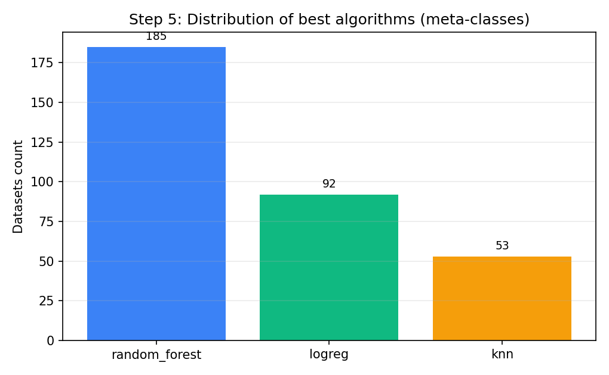
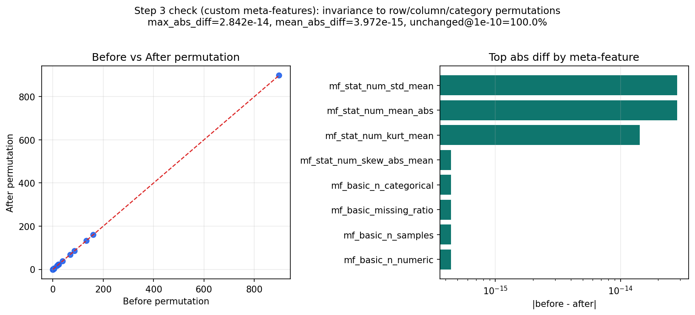
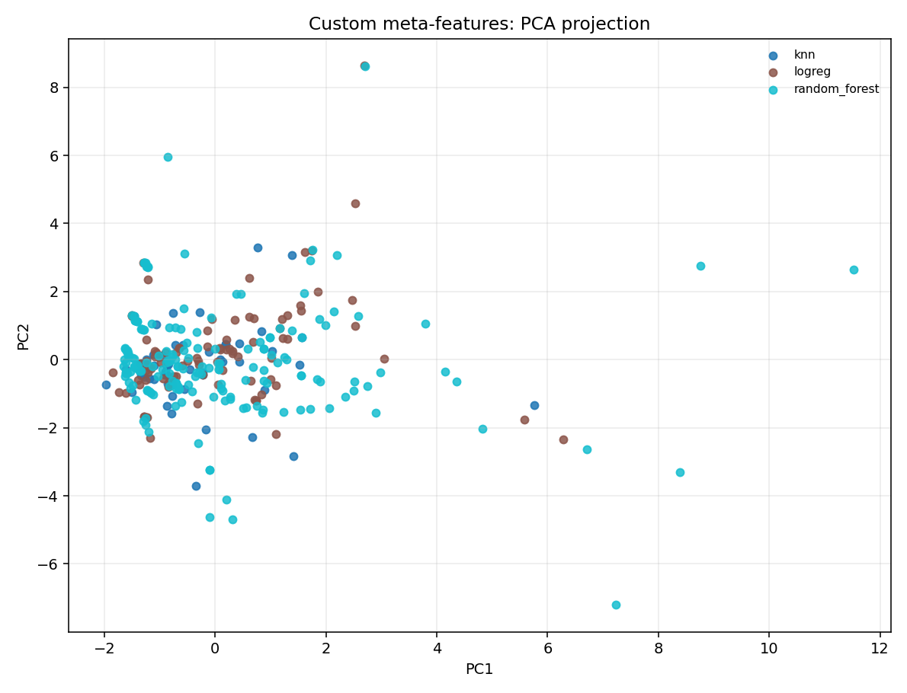
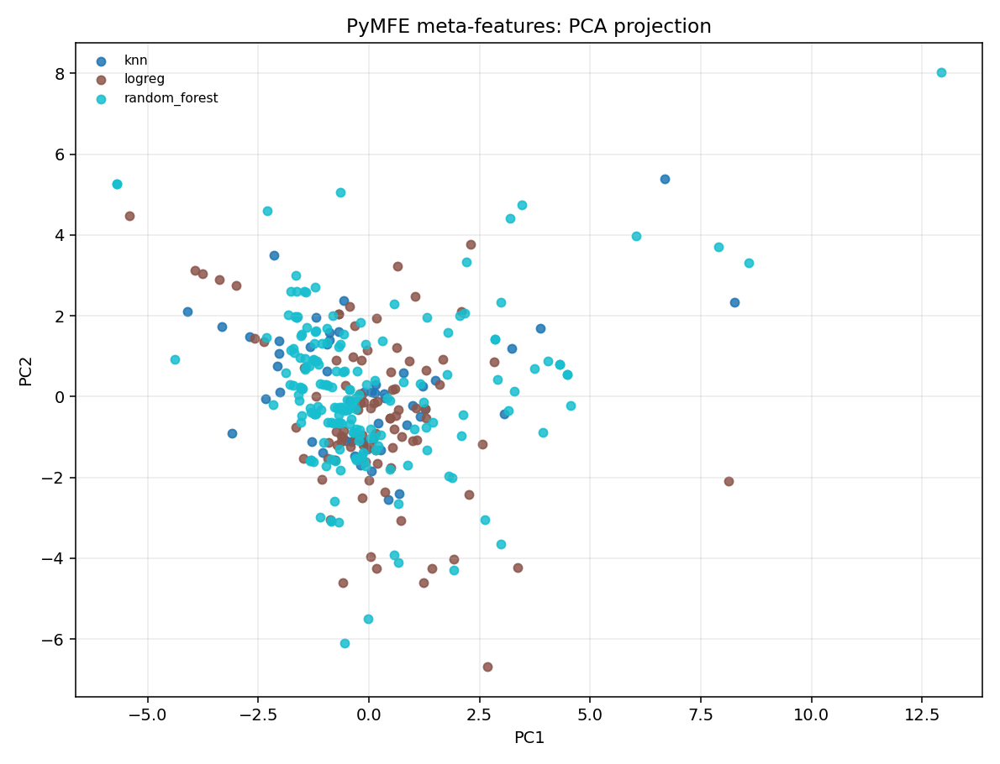
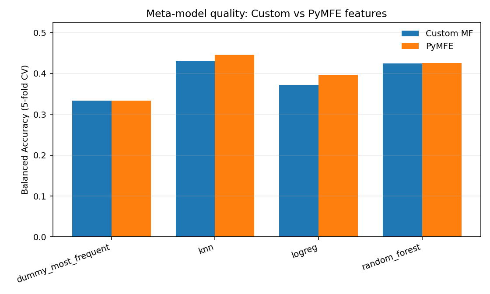

# Lab 2

## Чек-лист 
| Пункт | Что требовалось | Что сделано | Где смотреть |
|---|---|---|---|
| 1 | Получить наборы данных OpenML | Использован локальный архив `.arff` + индекс | `OpenML/data`, `OpenML/data.csv` |
| 2 | Реализовать базовые, статистические, структурные мета-признаки | Реализовано 18 custom мета-признаков в 3 группах | `src/auto_lab2/meta_features.py` |
| 3 | Проверить инвариантность к перестановке строк/столбцов/категорий | Проверка выполнена на custom MF, `max_abs_diff = 2.84e-14` | `outputs/custom/invariance_custom.csv`, `outputs/custom/step3_invariance_custom.png`, `outputs/custom/invariance_custom_summary.json` |
| 4 | Выбрать 3+ supervised алгоритма и метрику валидации | Использованы `logreg`, `knn`, `random_forest`; метрика `balanced_accuracy` | `src/auto_lab2/modeling.py` |
| 5 | Построить мета-набор и определить лучший алгоритм для каждого датасета | Построен мета-набор на 330 датасетах; распределение классов: RF=185, LR=92, KNN=53 | `outputs/custom/meta_dataset_custom.csv`, `outputs/custom/dataset_model_scores.csv` |
| 6 | Визуализировать мета-набор в 2D с цветами по мета-классам | Построена PCA-проекция для custom MF | `outputs/custom/meta_projection_custom.png` |
| 7 | Протестировать несколько supervised алгоритмов на мета-наборе, включая наивный | Протестированы `dummy`, `logreg`, `knn`, `random_forest` (5-fold CV) | `outputs/custom/meta_models_custom.csv` |
| 8 | Извлечь мета-признаки из полученного мета-набора | Извлечены мета-мета признаки custom MF | `outputs/custom/meta_meta_features_custom.json` |
| 9 | Повторить шаги 3-8 на мета-признаках PyMFE | Полный повтор выполнен на PyMFE, 330 датасетов | `outputs/pymfe/meta_dataset_pymfe.csv`, `outputs/pymfe/invariance_pymfe.csv`, `outputs/pymfe/meta_projection_pymfe.png`, `outputs/pymfe/meta_models_pymfe.csv`, `outputs/pymfe/meta_meta_features_pymfe.json` |

## Ключевые результаты
| Ветка признаков | Лучшая мета-модель | Accuracy (5-fold) | Balanced Accuracy (5-fold) |
|---|---:|---:|---:|
| Custom | `knn` | `0.5606` | `0.4296` |
| PyMFE | `knn` | `0.5909` | `0.4454` |

### Custom: все мета-модели
| Модель | Accuracy | Balanced Accuracy |
|---|---:|---:|
| `knn` | `0.5606` | `0.4296` |
| `random_forest` | `0.5697` | `0.4245` |
| `logreg` | `0.5576` | `0.3724` |
| `dummy_most_frequent` | `0.5606` | `0.3333` |

### PyMFE: все мета-модели
| Модель | Accuracy | Balanced Accuracy |
|---|---:|---:|
| `knn` | `0.5909` | `0.4454` |
| `random_forest` | `0.5636` | `0.4254` |
| `logreg` | `0.5758` | `0.3970` |
| `dummy_most_frequent` | `0.5606` | `0.3333` |

## Визуализации
### Шаг 5: распределение мета-классов

### Шаг 3: проверка инвариантности (до/после перестановок)

### Шаг 6: custom мета-признаки (PCA)

### Шаг 9 (повтор шага 6): PyMFE мета-признаки (PCA)

### Сравнение качества мета-моделей (custom vs PyMFE)

## Итоговые файлы
- Общая сводка: `outputs/report.json`
- Custom мета-набор: `outputs/custom/meta_dataset_custom.csv`
- PyMFE мета-набор: `outputs/pymfe/meta_dataset_pymfe.csv`

